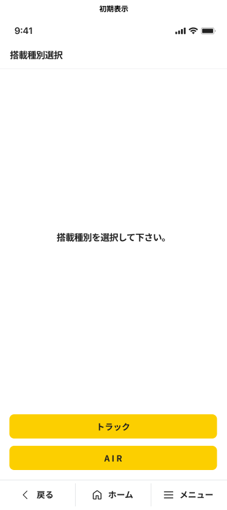

# N9P90M4X4004W002_搭載種別選択画面

## 1. 画面レイアウト

### 1.1. 画面レイアウト

## 2. 画面独自項目

### 2.1. 画面独自項目

|No.|階層|項目名|タイプ|ﾒﾓﾘ|必須|桁数|ｷｰType|初期値|フォーマット|制御|備考|
|:---:|:---:|:---|:---|:---:|:---:|:---:|:---|:---|:---|:---|:---|
|1|-|説明|ラベル|-|-|-|-|-|-|-|-|
|2|-|搭載種別選択リスト|リスト|-|○|-|-|-|-|4.1参照 4.2参照|-|

## 3. 画面共通項目

|No.|項目分類|階層|項目名|表示内容|制御内容|備考|
|:---:|:---|:---|:---|:---|:---|:---|
|1|ヘッダ|1|項目タイトル|搭載種別選択|画面名を表示する|-|
|2|ヘッダ|1|ファンクションボタン2|（非表示）|-|-|
|3|ヘッダ|1|ファンクションボタン1|（非表示）|-|-|
|4|ヘッダ|1|機能ボタン|（非表示）|-|-|
|5|フッタ|1|戻る|（表示）|-|「共通設計書_フッタ」を参照|
|6|フッタ|1|ホーム|（表示）|-|「共通設計書_フッタ」を参照|
|7|フッタ|1|メニュー|（表示）|-|「共通設計書_フッタ」を参照|
|8|フッタ|2|検索|（表示）|4.3参照|-|
|9|フッタ|2|小計|（表示）|（非活性）|-|
|10|フッタ|2|他機能遷移1|（非表示）|-|-|
|11|フッタ|2|他機能遷移2|（非表示）|-|-|
|12|フッタ|2|他機能遷移3|（非表示）|-|-|

## 4. 画面処理

### 4.1. 初期表示時

1. 搭載種別選択リストの生成

    1. 以下のユースケース処理を呼び出し、搭載種別リスト取得を行う。

        [ユースケース処理] :    [N9P90M4X4004U001_種別リスト取得](../02_Domain層/N9P90M4X4004U001_種別リスト取得.md)

        [パラメータ]

        |I/O|階層|項目名|値|備考|
        |:---:|:---|:---|:---|:---|
        |I|1|名称種別|「"TosaiSbt"」|搭載種別|
        |O|1|ワーク.メッセージID|メッセージID|SUCCESS: 処理成功|
        |O|1|ワーク.フィードバック区分|フィードバック区分|「"00": フィードバックなし」 「"03": 情報／警告・エラー」|
        |O|1|ワーク.種別リスト|種別リスト|-|
        |O|2|種別内ID|種別内ID|-|
        |O|2|名称|名称|-|

        1. ワーク.メッセージIDが「SUCCESS : 処理成功」の場合

            1. 以下の項目に値を設定する。

                |階層|項目名|値|備考|
                |:---|:---|:---|:---|
                |1|画面.搭載種別選択リスト|ワーク.種別リスト|-|
                |2|画面.搭載種別選択リスト[i]|ワーク.種別リスト[i].名称|i : リストの項目インデックス|

### 4.2. 搭載種別選択リスト選択時

1. 本機能専用領域の設定

    以下の項目に値を設定する。  

    |本機能専用領域|値|備考|
    |:---|:---|:---|
    |本機能専用領域.搭載種別|ワーク.種別リスト[i].種別内ID|i : 選択された項目のインデックス|
    |本機能専用領域.搭載種別名|画面.搭載種別選択リスト[i]|i : 選択された項目のインデックス|

1. 異常種別選択画面（N9P90M4X4004W003）に遷移する。（通常遷移）

### 4.3. 「検索」ボタン押下時の処理

1. 検索機能呼び出し

    [遷移先画面] : 検索起動画面（N9P90O1X7109N001）（通常遷移）

    [パラメータ]

    |I/O|項目名|値|備考|
    |:---:|:---|:---|:---|
    |I|遷移元機能ID|N9P90M4X4004|タイムサービス異常報告|
    |I|遷移元画面ID|W002|搭載種別選択画面|
    |O|ワーク.処理結果|処理結果|-|
    |O|ワーク.エラーメッセージID|エラーメッセージID|-|

1. 検索処理終了後

    1. 登録件数更新

        1. 以下のユースケース処理を呼び出し、登録した件数の記録を更新する。

           [ユースケース処理] : [N9P90M4X4004U002_登録件数更新](../02_Domain層/N9P90M4X4004U002_登録件数更新.md)

           [パラメータ]

           |I/O|項目名|値|備考|
           |:---:|:---|:---|:---|
           |I|-|-|-|
           |O|ワーク.メッセージID|メッセージID|-|
           |O|ワーク.フィードバック区分|フィードバック区分|「"00" : フィードバックなし」 「"03" : 情報／警告・エラー」|

    1. 『4.1. 初期表示時』の処理を行う。
