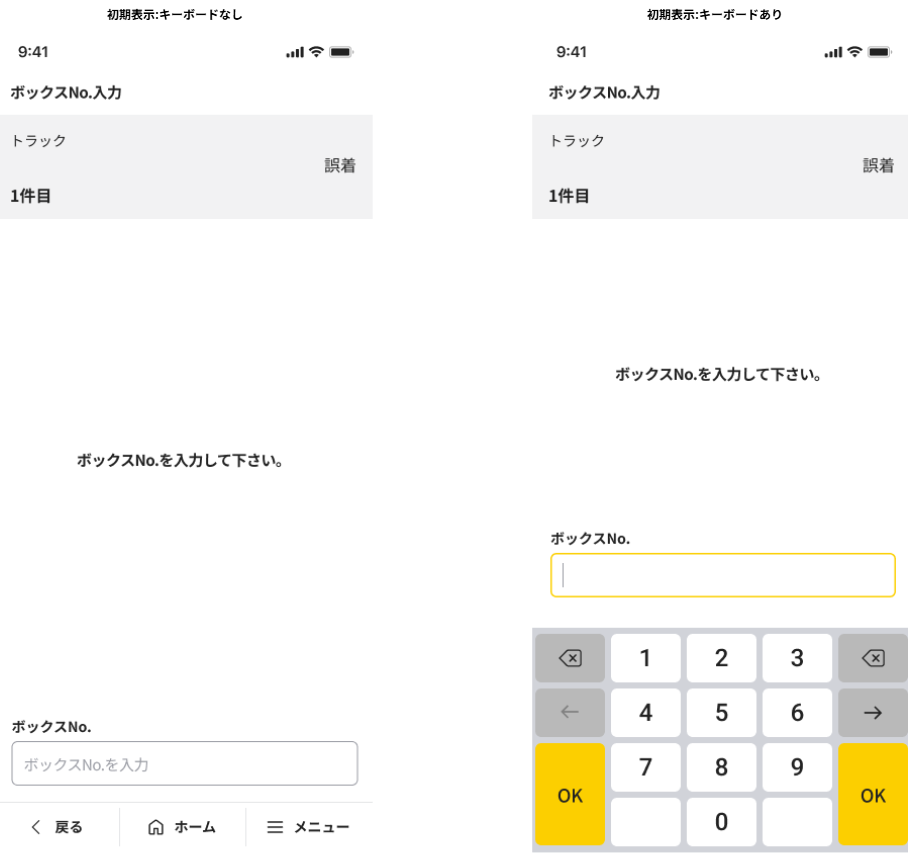

# N9P90M4X4004W004_ボックスNo.入力画面

## 1. 画面レイアウト

### 1.1. 画面レイアウト

## 2. 画面独自項目

### 2.1. 画面独自項目

|No.|階層|項目名|タイプ|ﾒﾓﾘ|必須|桁数|ｷｰType|初期値|フォーマット|制御|備考|
|:---:|:---:|:---|:---|:---:|:---:|:---:|:---|:---|:---|:---|:---|
|1|-|搭載種別名|ラベル|-|-|-|-|-|-|4.1参照|-|
|2|-|異常種別名|ラベル|-|-|-|-|-|-|4.1参照|-|
|3|-|件目|ラベル|-|-|-|-|-|{0}件目|4.1参照|-|
|4|-|説明|ラベル|-|-|-|-|-|-|-|-|
|5|-|ボックスNo.（見出し）|ラベル|-|-|-|-|-|-|-|-|
|6|-|ボックスNo.|テキストボックス|-|○|7|数|-|-|4.2参照 4.4参照|キーボードの種類 : Numeric 「ヒント : MP90ARIM40011」|

## 3. 画面共通項目

|No.|項目分類|階層|項目名|表示内容|制御内容|備考|
|:---:|:---|:---|:---|:---|:---|:---|
|1|ヘッダ|1|項目タイトル|ボックスNo.入力|画面名を表示する|-|
|2|ヘッダ|1|ファンクションボタン2|（非表示）|-|-|
|3|ヘッダ|1|ファンクションボタン1|（非表示）|-|-|
|4|ヘッダ|1|機能ボタン|（非表示）|-|-|
|5|フッタ|1|戻る|（表示）|-|「共通設計書_フッタ」を参照|
|6|フッタ|1|ホーム|（表示）|-|「共通設計書_フッタ」を参照|
|7|フッタ|1|メニュー|（表示）|-|「共通設計書_フッタ」を参照|
|8|フッタ|2|検索|（表示）|4.5参照|-|
|9|フッタ|2|小計|（表示）|4.3参照|-|
|10|フッタ|2|他機能遷移1|（非表示）|-|-|
|11|フッタ|2|他機能遷移2|（非表示）|-|-|
|12|フッタ|2|他機能遷移3|（非表示）|-|-|

## 4. 画面処理

### 4.1. 初期表示時

1. 画面項目の値を設定する。

    |項目名|値|備考|
    |:---|:---|:---|
    |画面.搭載種別名|本機能専用領域.搭載種別名|-|
    |画面.件目|【MP90ARIM40007】: 本機能専用領域.登録件数 + 1|-|
    |画面.異常種別名|本機能専用領域.異常種別名|-|

### 4.2. キーボードの「OK」ボタン押下時

1. 以下のユースケース処理を呼び出し、キーボードOKボタン押下処理を行う。

    [ユースケース処理] : [N9P90M4X4004U004_ボックスNo入力キーボードOKボタン押下処理](../02_Domain層/N9P90M4X4004U004_ボックスNo入力キーボードOKボタン押下処理.md)

    [パラメータ]

    |I/O|項目名|値|備考|
    |:---:|:---|:---|:---|
    |I|ボックスNo.|画面.ボックスNo.|-|
    |O|ワーク.メッセージID|メッセージID|SUCCESS : 処理成功 MP90AMEM40002 : 7チェックエラー MP90AMEM40003 : 最大数チェックエラー|
    |O|ワーク.フィードバック区分|フィードバック区分|「"00" : フィードバックなし」 「"03" : 情報／警告・エラー」|

    1. ワーク.メッセージIDが「SUCCESS : 処理成功」の場合

        1. 『4.1. 初期表示時』の処理を行う。

    1. 上記以外の場合

        1. ワーク.メッセージIDに値がある場合

            1. エラーメッセージ（ワーク.メッセージID）を表示する。

                1. 「OK」ボタン押下時

                    1. 画面.ボックスNo.をクリアして、メッセージを閉じる。

        1. 上記以外の場合

            1. 画面.ボックスNo.をクリアする。

### 4.3. 「小計」ボタン押下時

1. 小計確認画面（N9P90M4X4004W009）に遷移する。（通常遷移）

### 4.4. テキストボックス（ボックスNo.）フォーカス時

1. キーボードを表示する。

### 4.5. 「検索」ボタン押下時の処理

1. 検索機能呼び出し

    [遷移先画面] : 検索起動画面（N9P90O1X7109N001）（通常遷移）

    [パラメータ]

    |I/O|項目名|値|備考|
    |:---:|:---|:---|:---|
    |I|遷移元機能ID|N9P90M4X4004|タイムサービス異常報告|
    |I|遷移元画面ID|W004|ボックスNo.入力画面|
    |O|ワーク.処理結果|処理結果|-|
    |O|ワーク.エラーメッセージID|エラーメッセージID|-|

1. 検索処理終了後

    1. 登録件数更新

        1. 以下のユースケース処理を呼び出し、登録した件数の記録を更新する。

           [ユースケース処理] : [N9P90M4X4004U002_登録件数更新](../02_Domain層/N9P90M4X4004U002_登録件数更新.md)

           [パラメータ]

           |I/O|項目名|値|備考|
           |:---:|:---|:---|:---|
           |I|-|-|-|
           |O|ワーク.メッセージID|メッセージID|-|
           |O|ワーク.フィードバック区分|フィードバック区分|「"00" : フィードバックなし」 「"03" : 情報／警告・エラー」|

    1. 『4.1. 初期表示時』の処理を行う。
