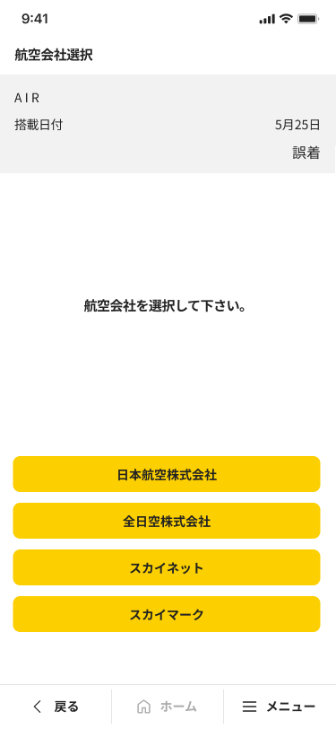

# N9P90M4X4004W006_航空会社選択画面

## 1. 画面レイアウト

### 1.1. 画面レイアウト

## 2. 画面独自項目

### 2.1. 画面独自項目

|No.|階層|項目名|タイプ|ﾒﾓﾘ|必須|桁数|ｷｰType|初期値|フォーマット|制御|備考|
|:---:|:---:|:---|:---|:---|:---|:---|:---|:---|:---|:---|:---|
|1|-|搭載種別名|ラベル|-|-|-|-|-|-|4.1参照|-|
|2|-|搭載日付(見出し)|ラベル|-|-|-|-|-|-|-|-|
|3|-|搭載日付|ラベル|-|-|-|-|-|{0}月{1}日|4.1参照|-|
|4|-|異常種別名|ラベル|-|-|-|-|-|-|4.1参照|-|
|5|-|説明|ラベル|-|-|-|-|-|-|-|-|
|6|-|航空会社選択リスト|リスト|-|○|-|-|-|-|4.1参照 4.2参照|-|

## 3. 画面共通項目

|No.|項目分類|階層|項目名|表示内容|制御内容|備考|
|:---:|:---|:---|:---|:---|:---|:---|
|1|ヘッダ|1|項目タイトル|航空会社選択|画面名を表示する|-|
|2|ヘッダ|1|ファンクションボタン2|（非表示）|-|-|
|3|ヘッダ|1|ファンクションボタン1|（非表示）|-|-|
|4|ヘッダ|1|機能ボタン|（非表示）|-|-|
|5|フッタ|1|戻る|（表示）|-|「共通設計書_フッタ」を参照|
|6|フッタ|1|ホーム|（表示）|（非活性）|-|
|7|フッタ|1|メニュー|（表示）|-|「共通設計書_フッタ」を参照|
|8|フッタ|2|検索|（表示）|4.3参照|-|
|9|フッタ|2|小計|（表示）|（非活性）|-|
|10|フッタ|2|他機能遷移1|（非表示）|-|-|
|11|フッタ|2|他機能遷移2|（非表示）|-|-|
|12|フッタ|2|他機能遷移3|（非表示）|-|-|

## 4. 画面処理

### 4.1. 初期表示時

1. 画面独自項目の設定

    以下の項目に値を設定する。

    |項目名|値|備考|
    |:---|:---|:---|
    |画面.搭載種別名|本機能専用領域.搭載種別名|-|
    |画面.異常種別名|本機能専用領域.異常種別名|-|
    |画面.搭載日付|【MP90ARIM40017】:   {0} : 本機能専用領域.搭載日付の月 {1} : 本機能専用領域.搭載日付の日|-|

1. 以下のユースケース処理を呼び出し、航空会社リストの取得を行う。

    [ユースケース処理] : [N9P90M4X4004U007_航空会社リスト取得](../02_Domain層/N9P90M4X4004U007_航空会社リスト取得.md)

    [パラメータ]

    |I/O|階層|項目名|値|備考|
    |:---:|:---:|:---|:---|:---|
    |I|1|-|-|-|
    |O|1|ワーク.メッセージID|メッセージID|SUCCESS : 処理成功|
    |O|1|ワーク.フィードバック区分|フィードバック区分|「"00" : フィードバックなし」 「"03" : 情報／警告・エラー」|
    |O|1|ワーク.航空会社リスト|航空会社リスト|-|
    |O|2|航空会社名（選択用）|航空会社名（選択用）|-|
    |O|2|航空会社名（表示用）|航空会社名（表示用）|-|
    |O|2|航空会社コード|航空会社コード|-|

    1. ワーク.メッセージIDがSUCCESSの場合

        |階層|項目名|値|備考|
        |:---|:---|:---|:---|
        |1|画面.航空会社リスト|ワーク.航空会社リスト|-|
        |2|画面.航空会社リスト[i]|ワーク.航空会社リスト[i].航空会社名（選択用）|i : リストの項目インデックス|

### 4.2. 航空会社選択リスト選択時

1. 以下の値を本機能専用領域に設定する。

    |本機能専用領域|値|備考|
    |:---|:---|:---|
    |航空会社名（表示用）|ワーク.航空会社リスト[i].航空会社名（表示用）|i : 選択された項目のインデックス|
    |航空会社コード|ワーク.航空会社リスト[i].航空会社コード|i : 選択された項目のインデックス|

1. 次画面遷移

    1. 以下の項目に値を設定する。

        |項目名|値|備考|
        |:---|:---|:---|
        |本機能専用領域.便名|ブランク（空文字）|-|

    1. 便名入力画面（N9P90M4X4004W007）に遷移する。（通常遷移）

### 4.3. 「検索」ボタン押下時

1. 検索機能呼び出し

    [遷移先画面] : 検索起動画面（N9P90O1X7109N001）（通常遷移）

    [パラメータ]

    |I/O|項目名|値|備考|
    |:---:|:---|:---|:---|
    |I|遷移元機能ID|N9P90M4X4004|タイムサービス異常報告|
    |I|遷移元画面ID|W006|航空会社選択画面|
    |O|ワーク.処理結果|処理結果|-|
    |O|ワーク.メッセージID|メッセージID|-|

1. 検索処理終了後

    1. 登録件数更新

        以下のユースケース処理を呼び出し、登録した件数の記録を更新する。

        [ユースケース処理] : [N9P90M4X4004U002_登録件数更新](../02_Domain層/N9P90M4X4004U002_登録件数更新.md)

        [パラメータ]

        |I/O|項目名|値|備考|
        |:---:|:---|:---|:---|
        |I|-|-|-|
        |O|ワーク.メッセージID|メッセージID|-|
        |O|ワーク.フィードバック区分|フィードバック区分|-|

    1. 『4.1. 初期表示時』の処理を行う。
