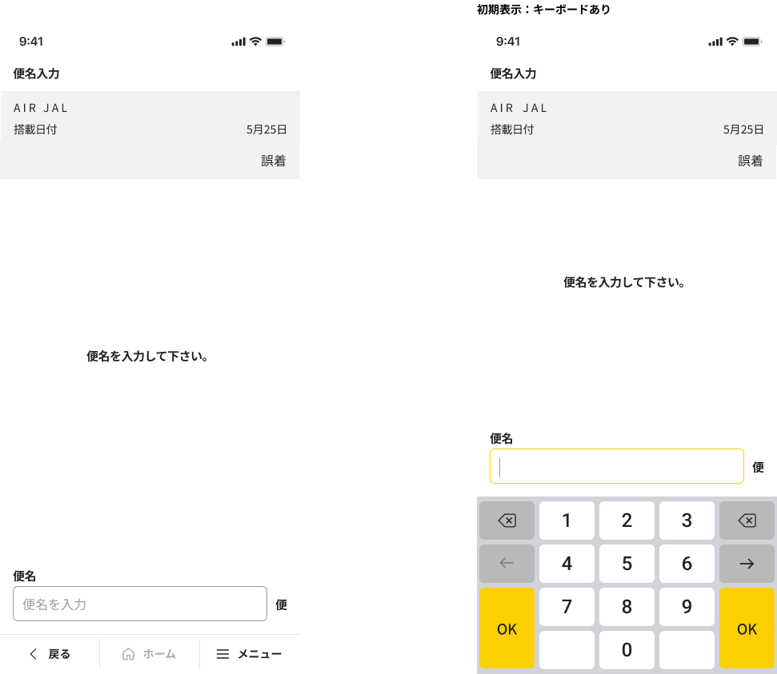

# N9P90M4X4004W007_便名入力画面

## 1. 画面レイアウト

### 1.1. 画面レイアウト

## 2. 画面独自項目

### 2.1. 画面独自項目

|No.|階層|項目名|タイプ|ﾒﾓﾘ|必須|桁数|ｷｰType|初期値|フォーマット|制御|備考|
|:---:|:---:|:---|:---|:---|:---|:---|:---|:---|:---|:---|:---|
|1|-|搭載種別／航空会社|ラベル|-|-|-|-|-|{0} {1}|4.1参照|-|
|2|-|搭載日付（見出し）|ラベル|-|-|-|-|-|-|-|-|
|3|-|搭載日付|ラベル|-|-|-|-|-|{0}月{1}日|4.1参照|-|
|4|-|異常種別名|ラベル|-|-|-|-|-|-|4.1参照|-|
|5|-|件目|ラベル|-|-|-|-|-|{0}件目|4.1参照|-|
|6|-|説明|ラベル|-|-|-|-|-|-|-|-|
|7|-|便名（見出し）|ラベル|-|-|-|-|-|-|-|-|
|8|-|便名|テキストボックス|-|○|4|数|-|-|4.1参照 4.3参照|キーボードの種類 : Numeric_英数転換 「ヒント : MP90ARIM40023」|
|9|-|便名（単位）|ラベル|-|-|-|-|-|-|-|-|

## 3. 画面共通項目

|No.|項目分類|階層|項目名|表示内容|制御内容|備考|
|:---:|:---|:---|:---|:---|:---|:---|
|1|ヘッダ|1|項目タイトル|便名入力|画面名を表示する|-|
|2|ヘッダ|1|ファンクションボタン2|（非表示）|-|-|
|3|ヘッダ|1|ファンクションボタン1|（非表示）|-|-|
|4|ヘッダ|1|機能ボタン|（非表示）|-|-|
|5|フッタ|1|戻る|（表示）|-|「共通設計書_フッタ」を参照|
|6|フッタ|1|ホーム|（表示）|（非活性）|-|
|7|フッタ|1|メニュー|-|-|「共通設計書_フッタ」を参照|
|8|フッタ|2|検索|（表示）|4.4参照|-|
|9|フッタ|2|小計|（表示）|（非活性）|-|
|10|フッタ|2|他機能遷移1|（非表示）|-|-|
|11|フッタ|2|他機能遷移2|（非表示）|-|-|
|12|フッタ|2|他機能遷移3|（非表示）|-|-|

## 4. 画面処理

### 4.1. 初期表示時

1. 画面項目の値を設定する。

    |項目名|値|備考|
    |:---|:---|:---|
    |画面.搭載種別／航空会社|【MP90ARIM40081】 : {0} : 本機能専用領域.搭載種別名 {1} : 本機能専用領域.航空会社名（表示用）|-|
    |画面.搭載日付|【MP90ARIM40017】:   {0} : 本機能専用領域.搭載日付の月 {1} : 本機能専用領域.搭載日付の日|-|
    |画面.異常種別名|本機能専用領域.異常種別名|-|
    |画面.便名|ブランク（空文字）|-|

1. 件目制御

    1. 本機能専用領域.異常種別が「01 : 誤着」以外の場合

        以下の項目に値を設定する。

        |項目名|値|備考|
        |:---|:---|:---|
        |画面.件目|【MP90ARIM40007】: 本機能専用領域.登録件数 + 1|-|

    1. 上記以外の場合

        以下の項目に値を設定する。

        |項目名|値|備考|
        |:---|:---|:---|
        |画面.件目|ブランク（空文字）|-|

### 4.2. キーボード「OK」ボタン押下時

1. 以下のユースケース処理を呼び出し、キーボード「OK」ボタン押下処理を行う。

    [ユースケース処理] : [N9P90M4X4004U008_便名入力キーボードOKボタン押下処理](../02_Domain層/N9P90M4X4004U008_便名入力キーボードOKボタン押下処理.md)

    [パラメータ]

    |I/O|項目名|値|備考|
    |:---:|:---|:---|:---|
    |I|便名|画面.便名|-|
    |O|ワーク.メッセージID|メッセージID|・SUCCESS : 処理成功 ・MP90AMEM40003 : 上限数エラー|
    |O|フィードバック区分|フィードバック区分|-|

    1. ワーク.メッセージIDが「SUCCESS」の場合

        1. 本機能専用領域.異常種別が「01 : 誤着」の場合

            1. コンテナNo.入力画面（N9P90M4X4004W008）に遷移する。（通常遷移）

        1. 本機能専用領域.異常種別が「01 : 誤着」以外の場合

            1. 搭載日付入力画面（N9P90M4X4004W005）に遷移する。（通常遷移）

    1. ワーク.メッセージIDが「SUCCESS」以外の場合

        1. ワーク.メッセージIDの値がある場合

            1. エラーメッセージ（ワーク.メッセージID）を表示し、メッセージの「OK」ボタンを押したら、メッセージを閉じて、画面.便名の値をクリアする。

        1. 上記以外の場合

            1. 画面.便名の値をクリアする。

### 4.3. テキストボックス「便名」フォーカス時

1. キーボードを表示する。

### 4.4. 「検索」ボタン押下時

1. 検索機能呼び出し

    [遷移先画面] : 検索起動画面（N9P90O1X7109N001）（通常遷移）

    [パラメータ]

    |I/O|項目名|値|備考|
    |:---:|:---|:---|:---|
    |I|遷移元機能ID|N9P90M4X4004|タイムサービス異常報告|
    |I|遷移元画面ID|W007|便名入力画面|
    |O|ワーク.処理結果|処理結果|-|
    |O|ワーク.メッセージID|メッセージID|-|

1. 検索処理終了後

    1. 登録件数更新

        以下のユースケース処理を呼び出し、登録した件数の記録を更新する。

        [ユースケース処理] : [N9P90M4X4004U002_登録件数更新](../02_Domain層/N9P90M4X4004U002_登録件数更新.md)

        [パラメータ]

        |I/O|項目名|値|備考|
        |:---:|:---|:---|:---|
        |I|-|-|-|
        |O|ワーク.メッセージID|メッセージID|-|
        |O|ワーク.フィードバック区分|フィードバック区分|-|

    1. 『4.1. 初期表示時』の処理を行う。
