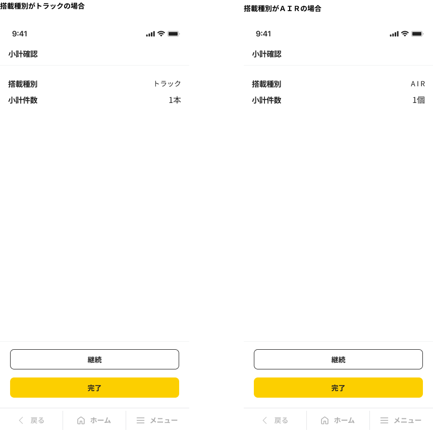
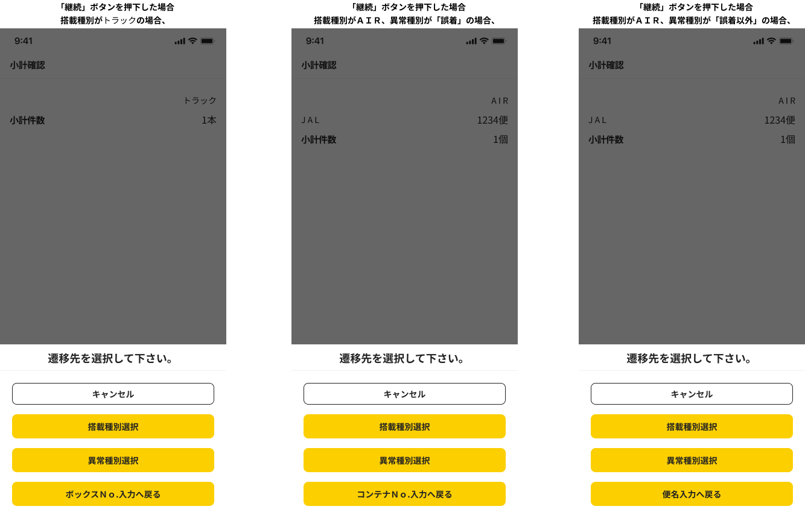

# N9P90M4X4004W009_小計確認画面

## 1. 画面レイアウト

### 1.1. 画面レイアウト

## 2. 画面独自項目

### 2.1. 画面独自項目

|No.|階層|項目名|タイプ|ﾒﾓﾘ|必須|桁数|ｷｰType|初期値|フォーマット|制御|備考|
|:---:|:---:|:---|:---|:---|:---|:---|:---|:---|:---|:---|:---|
|1|-|搭載種別（見出し）|ラベル|-|-|-|-|-|-|-|-|
|2|-|搭載種別|ラベル|-|-|-|-|-|-|4.1参照|-|
|3|-|小計件数（見出し）|ラベル|-|-|-|-|-|-|-|-|
|4|-|小計件数|ラベル|-|-|-|-|-|{0}本 {0}個|4.1参照|-|
|5|-|継続|ボタン|-|-|-|-|-|-|4.2参照|-|
|6|-|完了|ボタン|-|-|-|-|-|-|4.3参照|-|

### 2.2. 画面独自項目（ハーフモーダルI02の場合）

|No.|階層|項目名|タイプ|ﾒﾓﾘ|必須|桁数|ｷｰType|初期値|フォーマット|制御|備考|
|:---:|:---:|:---|:---|:---:|:---:|:---|:---|:---|:---|:---|:---|
|1|-|メッセージ|ラベル|-|-|-|-|-|-|-|-|
|2|-|キャンセル|ボタン|-|-|-|-|-|-|4.2.2.i参照|-|
|3|-|搭載種別選択|ボタン|-|-|-|-|-|-|4.2.2.i参照|-|
|4|-|異常種別選択|ボタン|-|-|-|-|-|-|4.2.2.i参照|-|
|5|-|ボックスNo.入力へ戻る|ボタン|-|-|-|-|-|-|4.2.2.i参照|-|
|6|-|コンテナNo.入力へ戻る|ボタン|-|-|-|-|-|-|4.2.2.i参照|-|
|7|-|便名入力へ戻る|ボタン|-|-|-|-|-|-|4.2.2.i参照|-|

## 3. 画面共通項目

|No.|項目分類|階層|項目名|表示内容|制御内容|備考|
|:---:|:---|:---|:---|:---|:---|:---|
|1|ヘッダ|1|項目タイトル|小計確認|画面名を表示する|-|
|2|ヘッダ|1|ファンクションボタン2|（非表示）|-|-|
|3|ヘッダ|1|ファンクションボタン1|（非表示）|-|-|
|4|ヘッダ|1|機能ボタン|（非表示）|-|-|
|5|フッタ|1|戻る|（表示）|（非活性）|-|
|6|フッタ|1|ホーム|（表示）|（非活性）|-|
|7|フッタ|1|メニュー|（表示）|（非活性）|-|
|8|フッタ|2|検索|（非表示）|-|-|
|9|フッタ|2|小計|（非表示）|-|-|
|10|フッタ|2|他機能遷移1|（非表示）|-|-|
|11|フッタ|2|他機能遷移2|（非表示）|-|-|
|12|フッタ|2|他機能遷移3|（非表示）|-|-|

## 4. 画面処理

### 4.1. 初期表示時

1. 画面項目の値を設定する。

    1. 本機能専用領域.搭載種別が「01 : トラック」の場合

        画面の表示内容を設定する。

        |項目名|値|備考|
        |:---|:---|:---|
        |画面.搭載種別|本機能専用領域.搭載種別|-|
        |画面.小計件数|【MP90ARIM40030】: 本機能専用領域.登録件数|フォーマット : {0}本|

    1. 上記以外の場合

        画面の表示内容を設定する。

        |項目名|値|備考|
        |:---|:---|:---|
        |画面.搭載種別|本機能専用領域.搭載種別|-|
        |画面.小計件数|【MP90ARIM40031】: 本機能専用領域.登録件数|フォーマット : {0}個|

### 4.2. 「継続」ボタン押下時

1. 本機能専用領域.登録件数が0件の場合

    1. 本機能専用領域.搭載種別が「01 : トラック」の場合

        1. ボックスNo.入力画面（N9P90M4X4004W004）に遷移する。（戻り遷移）

    1. 上記以外の場合

        1. 搭載日付入力画面（N9P90M4X4004W005）に遷移する。（戻り遷移）

1. 上記以外の場合

    1. メッセージ（MP90AMQM40034）を表示する。

        画面項目に以下の制御を設定する。

        |項目名|制御内容|備考|
        |:---|:---|:---|
        |「キャンセル」ボタン|表示|-|
        |「搭載種別選択」ボタン|表示|-|
        |「異常種別選択」ボタン|表示|-|

        1. 本機能専用領域.搭載種別が「01 : トラック」の場合

            |項目名|制御内容|備考|
            |:---|:---|:---|
            |「ボックスNo.入力へ戻る」ボタン|表示|-|
            |「コンテナNo.入力へ戻る」ボタン|非表示|-|
            |「便名入力へ戻る」ボタン|非表示|-|

        1. 上記以外の場合

            1. 本機能専用領域.異常種別が「01 : 誤着」の場合

                |項目名|制御内容|備考|
                |:---|:---|:---|
                |「ボックスNo.入力へ戻る」ボタン|非表示|-|
                |「コンテナNo.入力へ戻る」ボタン|表示|-|
                |「便名入力へ戻る」ボタン|非表示|-|

            1. 上記以外の場合

                |項目名|制御内容|備考|
                |:---|:---|:---|
                |「ボックスNo.入力へ戻る」ボタン|非表示|-|
                |「コンテナNo.入力へ戻る」ボタン|非表示|-|
                |「便名入力へ戻る」ボタン|表示|-|

    1. 「搭載種別選択」ボタン押下時

        1. 以下の項目に値を設定する。

            |項目名|値|備考|
            |:---|:---|:---|
            |ワーク.再開フラグ|01|搭載種別選択再開|

        1. 『5.1. 継続時入力情報クリア処理』の処理を行う。

        1. 搭載種別選択画面（N9P90M4X4004W002）に遷移する。（戻り遷移）

    1. 「異常種別選択」ボタン押下時

        1. 以下の項目に値を設定する。

            |項目名|値|備考|
            |:---|:---|:---|
            |ワーク.再開フラグ|02|異常種別選択再開|

        1. 『5.1. 継続時入力情報クリア処理』の処理を行う。

        1. 異常種別選択画面（N9P90M4X4004W003）に遷移する。（戻り遷移）

    1. 「ボックスNo.入力へ戻る」ボタン押下時

        1. ボックスNo.入力画面（N9P90M4X4004W004）に遷移する。（戻り遷移）

    1. 「コンテナNo.入力へ戻る」ボタン押下時

        1. コンテナNo.入力画面（N9P90M4X4004W008）に遷移する。（戻り遷移）

    1. 「便名入力へ戻る」ボタン押下時

        1. 以下の項目に値を設定する。

            |項目名|値|備考|
            |:---|:---|:---|
            |本機能専用領域.便名|ブランク（空文字）|-|

        1. 便名入力画面（N9P90M4X4004W007）に遷移する。（戻り遷移）

    1. メッセージの「キャンセル」ボタン押下時

        1. ダイアログを閉じる。

### 4.3. 「完了」ボタン押下時

1. 本機能専用領域の削除

    1. 以下のユースケース処理を呼び出し、本機能専用領域の項目の削除を行う。

        [ユースケース処理] : [N9P90M4X4004U010_機能終了処理](../02_Domain層/N9P90M4X4004U010_機能終了処理.md)

        [パラメータ]

        |I/O|項目名|値|備考|
        |:---:|:---|:---|:---|
        |I|-|-|-|
        |O|ワーク.フィードバック区分|フィードバック区分|「"00" : フィードバックなし」|

1. 本機能を終了する。

## 5. 画面共通処理

### 5.1. 継続時入力情報クリア処理

1. 以下のユースケース処理を呼び出し、継続時入力情報クリア処理を行う。

    [ユースケース処理] : [N9P90M4X4004U014_継続時入力情報クリア処理](../02_Domain層/N9P90M4X4004U014_継続時入力情報クリア処理.md)

    [パラメータ]

    |I/O|項目名|値|備考|
    |:---:|:---|:---|:---|
    |I|再開フラグ|ワーク.再開フラグ|-|
    |O|ワーク.メッセージID|メッセージID|SUCCESS : 処理成功 NO_DATA_ERROR:データ存在エラー|
    |O|ワーク.フィードバック区分|フィードバック区分|「"00" : フィードバックなし」 「"03" : 情報／警告・エラー」|
