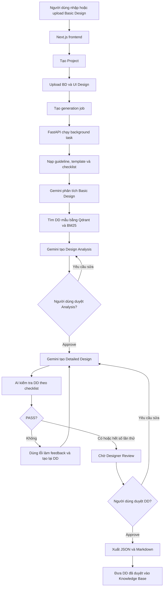

# Giải thích luồng chạy dự án BD-to-DD Toolkit

## 1. Tổng quan dành cho người mới

Dự án này là một “dây chuyền AI” biến tài liệu **Basic Design (BD)** thành **Detailed Design (DD)**.

Hệ thống không tạo DD ngay khi người dùng đưa BD vào. Quy trình có hai điểm dừng để con người kiểm tra:

1. AI đọc BD và tạo bản phân tích thiết kế.
2. Người dùng kiểm tra và duyệt bản phân tích.
3. AI tạo Detailed Design dựa trên bản phân tích đã duyệt.
4. AI tự kiểm tra DD và sửa lại nếu phát hiện vấn đề.
5. Người dùng kiểm tra và duyệt DD.
6. Hệ thống xuất file và đưa DD đã duyệt vào kho kiến thức.



## 2. Những phần chính của dự án

Dự án gồm ba khối chính:

- `frontend/`: giao diện web để nhập BD, xem trạng thái và duyệt kết quả.
- `backend/`: API và toàn bộ logic xử lý AI.
- `INPUT/`: guideline, prompt, template, component dùng chung và tài liệu mẫu.

Có thể hình dung:

- Frontend là **quầy tiếp nhận**.
- Backend là **nhà máy xử lý**.
- `INPUT/` là **sổ tay quy chuẩn**.
- Knowledge Base là **tủ hồ sơ chứa các DD tốt đã được duyệt**.

## 3. Khi người dùng đưa Basic Design vào

### 3.1. Frontend đọc nội dung

Điểm bắt đầu là component `Home` trong:

```text
frontend/app/page.tsx
```

Frontend hiện không còn dùng luồng đọc `file.text()` rồi tự ghép payload text như phiên bản đầu.

Khi người dùng nhấn **Generate**, hàm `handleGenerate()` thực hiện:

1. Gọi API tạo project.
2. Tạo một `FormData` bundle gồm:
   - file Markdown chính `design`
   - nhiều file ảnh UI `images`
   - file CSV composable `composable` nếu có
3. Upload bundle này vào endpoint `design-input`.
4. Gọi API Generate.
5. Cứ ba giây hỏi backend xem job đang ở trạng thái nào.

Điểm cần lưu ý:

- file thiết kế chính hiện bắt buộc là Markdown `.md`;
- ảnh UI được gửi riêng để backend dùng Gemini Flash đọc nội dung;
- composable list là file `.csv`;
- frontend không phải pipeline trích xuất PDF, Word hoặc Excel trực tiếp.

Các API được gọi theo thứ tự:

```text
POST /api/v1/projects
POST /api/v1/projects/{projectId}/documents/design-input
POST /api/v1/projects/{projectId}/generate
GET  /api/v1/projects/{projectId}/generations/{jobId}
```

Frontend được viết bằng Next.js, React và TypeScript:

- **React** quản lý nội dung nhập, trạng thái job và kết quả.
- **Next.js** cung cấp cấu trúc ứng dụng web.
- **TypeScript** giúp phát hiện lỗi kiểu dữ liệu sớm.
- **fetch()** dùng để gọi API FastAPI.

## 4. Backend nhận và lưu Basic Design

Các API chính nằm trong:

```text
backend/app/presentation/api/v1/router.py
```

Với giao diện hiện tại, luồng upload chính là:

```text
upload_design_input_bundle()
    -> _read_uploaded_document()
    -> save_document()
```

`save_document()` nằm trong:

```text
backend/app/infrastructure/persistence/postgres/document_store.py
```

Backend sẽ:

- đọc file Markdown chính;
- đọc từng ảnh UI bằng Gemini Flash nếu người dùng có upload ảnh;
- đọc file CSV composable nếu có;
- ghép phần UI/CSV thành một document text duy nhất;
- lưu kết quả vào document store.

Nội dung runtime được lưu thành file:

```text
TMP_DIR/{project_id}/basic-design.txt
TMP_DIR/{project_id}/ui-design.txt
```

Trong môi trường Docker Compose hiện tại:

```text
/runtime/tmp/{project_id}/basic-design.txt
/runtime/tmp/{project_id}/ui-design.txt
```

Tên thư mục `postgres` có thể gây hiểu nhầm. Tài liệu BD và UI Design thực tế được lưu trong filesystem. Database chỉ quản lý project, generation job và trạng thái của job.

Backend sử dụng FastAPI:

- `@router.post(...)` định nghĩa API.
- `UploadFile` nhận file upload.
- `BackgroundTasks` chạy generation sau khi API đã trả `jobId`.
- `HTTPException` trả lỗi HTTP phù hợp.

## 5. Khởi tạo generation job

API Generate nằm trong `router.py` và thực hiện:

1. Kiểm tra BD đã tồn tại chưa.
2. Tạo một `job_id` ngẫu nhiên bằng UUID.
3. Lưu job với trạng thái `pending`.
4. Đưa `_run_generation_job()` vào background task.
5. Trả `jobId` cho frontend ngay lập tức.

Do đó trình duyệt không phải giữ kết nối và chờ AI chạy xong.

Frontend dùng `pollGeneration()` để hỏi trạng thái mỗi ba giây.

Các trạng thái chính:

```text
pending
analyzing
retrieving_samples
generating_analysis
needs_analysis_review
generating_dd
validating
needs_manual_review
completed
failed
```

Ý nghĩa:

| Trạng thái | Ý nghĩa |
|---|---|
| `pending` | Job vừa được tạo và đang chờ chạy |
| `analyzing` | Hệ thống đang đọc và phân tích BD |
| `retrieving_samples` | Hệ thống đang tìm DD mẫu |
| `generating_analysis` | AI đang tạo Design Analysis |
| `needs_analysis_review` | Chờ người dùng duyệt Design Analysis |
| `generating_dd` | AI đang tạo Detailed Design |
| `validating` | AI đang kiểm tra Detailed Design |
| `needs_manual_review` | Chờ designer kiểm tra DD |
| `completed` | Đã duyệt và xuất artifact |
| `failed` | Pipeline gặp lỗi |

## 6. Pipeline phân tích Basic Design

Trung tâm của dự án là class `GenerationService` trong:

```text
backend/app/application/use_cases/generate_detail_design.py
```

Hàm `run()` hiện chỉ gọi pha phân tích:

```text
run()
    -> run_analysis_phase()
```

Điều này có nghĩa là nhấn Generate chưa tạo DD ngay. Hệ thống tạo Design Analysis trước và dừng ở `needs_analysis_review`.

### 6.1. Step 1 — Bootstrap common input

Hệ thống đọc các dữ liệu dùng chung:

- guideline;
- template;
- checklist;
- planning skills;
- common component;
- prompt.

Nguồn dữ liệu chủ yếu nằm trong:

```text
INPUT/common/guidelines/
INPUT/common/templates/
INPUT/common/prompts/
INPUT/common/common-components/
```

Ý nghĩa của bước này: AI không chỉ nhìn BD rồi tự viết tùy ý. AI được cung cấp thêm luật viết tài liệu, mẫu tài liệu và các thành phần chuẩn của dự án.

### 6.2. Step 2 — Basic Design Analytics

Các chain được khởi tạo trong hàm `_build_chains()` của `GenerationService`.

AI được yêu cầu biến BD từ một đoạn văn lớn thành JSON có cấu trúc:

```text
summary
modules
screens
entities
businessFlows
apiCandidates
externalInterfaces
uiSignals
assumptions
```

Ví dụ, từ yêu cầu:

> Người dùng đăng ký bằng email và phải xác nhận OTP.

AI có thể tạo:

```json
{
  "entities": ["User", "Otp"],
  "businessFlows": [
    "Nhập email",
    "Gửi OTP",
    "Xác nhận OTP"
  ],
  "apiCandidates": [
    "/api/register",
    "/api/verify-otp"
  ]
}
```

Đây không phải parser có tập luật cố định. Trong điều kiện bình thường, Gemini thực hiện việc hiểu ngữ nghĩa. Sau đó code Python normalize kết quả để đảm bảo các trường cần là danh sách đều có cùng định dạng.

### 6.3. Cơ chế fallback

Nếu Gemini không được cấu hình hoặc gọi Gemini bị lỗi, dự án có một fallback đơn giản:

- Tìm các từ bắt đầu bằng chữ hoa để đoán entity.
- Lấy một số dòng đầu làm business flow.
- Tạo đường dẫn `/api/{entity}`.
- Mặc định module là `screen`, `api`, `batch`.

Fallback nằm trong `_fallback_basic_design_analytics()`.

Fallback chủ yếu giúp pipeline vẫn chạy khi demo hoặc test. Chất lượng của nó không tương đương khả năng phân tích của Gemini.

## 7. Tìm các Detailed Design mẫu

Sau khi hiểu BD, hệ thống tìm các DD cũ đã được duyệt và có nội dung tương tự.

Đây là mô hình **RAG — Retrieval-Augmented Generation**:

> Trước khi yêu cầu AI viết, hệ thống tìm tài liệu liên quan rồi đưa chúng vào prompt làm tài liệu tham khảo.

### 7.1. Tạo truy vấn tìm kiếm

Logic nằm trong:

```text
backend/app/application/services/retrieval_query_service.py
```

Hệ thống tạo hai loại truy vấn:

- **Dense query**: BD đầy đủ, summary, entity và business flow.
- **Sparse query**: screen ID, entity, API và các từ khóa chính xác.

Hệ thống còn tạo filter:

```text
approval_status = reviewed
module_type = screen/api/batch nếu xác định được
component_id = mã như N9P90M4X4004W002 nếu chỉ có một mã
```

Như vậy chỉ những DD đã được duyệt mới được dùng làm mẫu.

### 7.2. Dense search bằng Gemini Embedding và Qdrant

Gemini Embedding biến một đoạn văn thành một danh sách số gọi là vector. Những đoạn có ý nghĩa gần nhau thường có vector gần nhau.

Ví dụ:

```text
Đăng ký tài khoản bằng email
```

có thể gần với:

```text
User onboarding and email verification
```

dù hai câu không sử dụng chính xác cùng từ ngữ.

Qdrant lưu các vector và tìm tối đa 20 đoạn gần nhất.

### 7.3. Keyword search bằng BM25

BM25 tìm kiếm theo từ khóa chính xác. Nó hữu ích với:

- mã màn hình;
- tên class;
- tên API;
- mã component;
- thuật ngữ kỹ thuật.

Ví dụ, mã `N9P90M4X4004W002` cần được khớp chính xác. Vector search đơn thuần có thể xử lý trường hợp này không tốt bằng BM25.

### 7.4. Ghép kết quả bằng Reciprocal Rank Fusion

Hàm `HybridSearchService.fuse()` nằm trong:

```text
backend/app/application/services/hybrid_search_service.py
```

Nó sử dụng công thức Reciprocal Rank Fusion, gọi tắt là RRF:

```text
điểm = tổng 1 / (60 + vị trí xếp hạng)
```

Một tài liệu xuất hiện ở vị trí cao trong cả Qdrant và BM25 sẽ nhận điểm tốt hơn.

Ưu điểm của RRF là không cần so sánh trực tiếp điểm Qdrant với điểm BM25 vì hai hệ thống có thang điểm khác nhau.

### 7.5. Rerank

`RerankService` nằm trong:

```text
backend/app/application/services/rerank_service.py
```

Nó xếp hạng lại bằng công thức gần tương đương:

```text
điểm cuối
= điểm RRF
+ số từ trùng × 0.01
+ điểm chất lượng × 0.05
+ điểm thưởng do tài liệu đã được tái sử dụng
```

Sau RRF, hệ thống còn chạy một bước rerank nội bộ:

- cộng thêm điểm giao nhau token giữa query và candidate;
- cộng điểm chất lượng của sample;
- cộng điểm thưởng nếu sample đã từng được tái sử dụng.

Sau đó `select_adaptive_top_k()`:

- luôn lấy ít nhất ba kết quả;
- lấy tối đa tám kết quả;
- dừng nếu điểm giữa hai kết quả giảm quá mạnh.

Kết quả cuối cùng không chỉ dùng làm `sampleDesigns` cho AI, mà còn được ghi vào `executionTrace` để frontend hiển thị:

- truy vấn dense/sparse;
- dense hits;
- sparse hits;
- kết quả RRF;
- context cuối cùng được chọn.

## 8. Tạo Design Analysis

Sau retrieval, Gemini nhận:

- BD gốc;
- kết quả Basic Design Analytics;
- UI Design nếu có;
- DD mẫu vừa tìm được;
- guideline;
- template;
- common component.

Gemini tạo `design_analysis` gồm:

```text
summary
scope
entities
businessFlows
apiCandidates
uiSignals
risks
assumptions
```

Design Analysis có thể được hiểu là **bản kế hoạch trước khi viết DD**.

Khi bước này hoàn tất, backend đặt trạng thái:

```text
needs_analysis_review
```

Pipeline dừng và chờ người dùng kiểm tra.

Từ phiên bản hiện tại, backend còn lưu thêm:

```text
executionTrace.steps
```

để frontend có thể hiển thị output từng bước ngay trên giao diện review.

## 9. Người dùng duyệt Design Analysis

API xử lý nằm trong `submit_analysis_review()` của `router.py`.

Người dùng có hai lựa chọn.

### 9.1. Request update

Feedback của người dùng được đưa lại vào prompt. Gemini tạo lại Design Analysis nhưng vẫn giữ:

- BD analytics;
- các mẫu đã tìm;
- lịch sử review;
- common input.

### 9.2. Approve

Backend thực hiện:

1. Đánh dấu `analysisReview.status = approved`.
2. Ghi `generationProgress` để frontend biết DD đang được sinh.
3. Đặt job thành `generating_dd`.
4. Chạy `_run_detail_design_job()` trong background.
5. Trong background, gọi `run_detail_design_phase()`.

Frontend gửi yêu cầu này từ hàm `submitAnalysisReview()` trong `frontend/app/page.tsx`.

## 10. Tạo Detailed Design và auto-review

Pha DD bắt đầu trong hàm `run_detail_design_phase()`.

Dữ liệu đưa vào AI gồm:

```text
Basic Design
UI Design
Basic Design Analytics
Design Analysis đã duyệt
DD mẫu
template
guideline
common components
review feedback
```

Kết quả DD được chia thành các module như:

```text
screen
api
batch
```

Mỗi module có thể chứa các phần như:

- UI Design;
- component;
- data model;
- API integration;
- business logic;
- state management;
- data access;
- batch processing.

### 10.1. Vòng lặp tự kiểm tra

Logic nằm trong `_run_review_loop()` của `GenerationService`.

Thuật toán:

```text
feedback = []

Lặp tối đa MAX_REVIEW_ITERATIONS:
    Sinh DD dựa trên input và feedback
    Kiểm tra DD theo checklist

    Nếu PASS:
        Dừng vòng lặp

    Nếu NG và có lỗi cụ thể:
        feedback = danh sách lỗi
        Quay lại sinh DD

    Nếu NG nhưng không có lỗi cụ thể:
        Dừng và yêu cầu con người kiểm tra
```

Mặc định số lần lặp là hai, được cấu hình bằng:

```text
MAX_REVIEW_ITERATIONS=2
```

Đây là mô hình:

```text
Generate -> Critique -> Regenerate
```

Nói đơn giản:

1. Một chain đóng vai người viết.
2. Một chain đóng vai reviewer.
3. Reviewer đưa lỗi lại cho người viết.
4. Người viết tạo lại bản DD tốt hơn.

Từ phiên bản hiện tại, mỗi vòng generate/review còn append thêm 2 bước vào `executionTrace`:

- `detail_design_generation`
- `detail_design_review`

Sau vòng lặp, hệ thống chuyển sang:

```text
needs_manual_review
```

Auto-review PASS không đồng nghĩa tự động xuất file. Con người vẫn phải approve.

## 11. Gemini và LangChain được dùng như thế nào?

Code tích hợp nằm trong:

```text
backend/app/infrastructure/langchain/chains.py
```

Một chain cơ bản:

```text
System prompt
    +
User prompt chứa dữ liệu BD
    ↓
Gemini
    ↓
JsonOutputParser
    ↓
Python dictionary
```

Trong code, pipeline tương tự:

```python
ChatPromptTemplate
| Gemini
| JsonOutputParser
| RunnableLambda
```

Vai trò của từng thành phần:

- `ChatPromptTemplate`: điền BD, guideline và DD mẫu vào prompt.
- `ChatGoogleGenerativeAI`: gọi Gemini.
- `JsonOutputParser`: yêu cầu và phân tích JSON thay vì văn bản tự do.
- `RunnableLambda`: biến một hàm Python thành một bước trong chain.
- `RunnablePassthrough.assign`: giữ dữ liệu hiện tại và bổ sung dữ liệu mới.

Nếu Gemini trả JSON sai định dạng, hệ thống thử lại tối đa hai lần. Sau đó hệ thống dùng fallback Python. Với các lỗi khác, code hiện chuyển sang fallback ngay.

LangChain đóng vai trò **bộ nối đường ống**, không phải mô hình AI. Mô hình AI thực tế là Gemini.

Ngoài `pipeline.stages` tóm tắt, payload generation hiện còn có:

```text
generationProgress
executionTrace
```

để frontend vừa poll trạng thái, vừa hiển thị output chi tiết từng bước.

## 12. Designer Review và xuất file

Sau khi DD được sinh, người dùng có hai lựa chọn.

### 12.1. Request update

Feedback của designer được đưa lại vào vòng:

```text
Generate DD -> Auto-review -> Generate lại nếu cần
```

### 12.2. Approve

`DesignerReviewService.approve()` thực hiện:

1. Đặt manual review thành `approved`.
2. Gọi `export_artifacts()`.
3. Tạo hai file:

```text
detail-design.json
detail-design.md
```

Logic xuất file nằm trong:

```text
backend/app/infrastructure/persistence/postgres/export_repository.py
```

Đường dẫn mặc định theo config là:

```text
ARTIFACTS_DIR/{project_id}/{job_id}/detail-design.json
ARTIFACTS_DIR/{project_id}/{job_id}/detail-design.md
```

Trong Docker Compose hiện tại, `ARTIFACTS_DIR=/runtime/artifacts`, nên artifact thực tế nằm ở:

```text
/runtime/artifacts/{project_id}/{job_id}/detail-design.json
/runtime/artifacts/{project_id}/{job_id}/detail-design.md
```

Sau đó `knowledge_base.ingest_generated_reviewed_dd()` đưa DD vừa duyệt vào Qdrant và BM25 để những lần sinh sau có thể dùng nó làm tài liệu mẫu.

Đây là vòng cải thiện ở cấp hệ thống:

```text
DD đã duyệt
    -> lưu vào Knowledge Base
    -> lần xử lý sau tìm thấy nó
    -> dùng làm mẫu cho DD mới
```

Quá trình này không huấn luyện lại mô hình Gemini. Nó chỉ bổ sung tài liệu tham khảo cho RAG.

## 13. Vai trò của từng framework và thư viện

| Framework hoặc thành phần | Vai trò dễ hiểu |
|---|---|
| Next.js | Khung xây dựng trang web |
| React | Quản lý ô nhập liệu, nút bấm, trạng thái và kết quả |
| TypeScript | Kiểm tra kiểu dữ liệu phía frontend |
| FastAPI | Tạo API HTTP cho frontend |
| Uvicorn | Chạy ứng dụng FastAPI |
| Pydantic | Kiểm tra cấu trúc dữ liệu request |
| SQLAlchemy | Đọc và ghi project, generation job vào database |
| SQLite hoặc PostgreSQL | Lưu trạng thái project và job |
| LangChain | Ghép prompt, Gemini, parser và các bước pipeline |
| Gemini | Phân tích BD, tạo analysis, tạo DD và review |
| Gemini Embedding | Chuyển văn bản thành vector ngữ nghĩa |
| Qdrant | Tìm tài liệu giống nhau về ý nghĩa |
| BM25 | Tìm tài liệu theo từ khóa chính xác |
| python-multipart | Cho FastAPI nhận file upload |
| python-dotenv | Đọc API key và cấu hình từ file `.env` |

## 14. Danh sách file chạy theo thứ tự

Luồng chính khi người dùng nhấn Generate:

```text
frontend/app/page.tsx
    ↓
backend/app/main.py
    ↓
backend/app/presentation/api/v1/router.py
    ↓
backend/app/infrastructure/persistence/postgres/document_store.py
    ↓
backend/app/application/use_cases/generate_detail_design.py
    ↓
backend/app/application/services/common_input_service.py
    ↓
backend/app/application/services/prompt_runtime_service.py
    ↓
backend/app/infrastructure/langchain/chains.py
    ↓
backend/app/application/services/retrieval_query_service.py
    ↓
backend/app/application/use_cases/ingest_reviewed_dd.py
    ├── infrastructure/embedding/gemini_embedder.py
    ├── infrastructure/vectorstore/qdrant_repository.py
    ├── infrastructure/search/bm25_repository.py
    ├── application/services/hybrid_search_service.py
    ├── application/services/rerank_service.py
    └── application/services/context_assembly_service.py
    ↓
backend/app/application/use_cases/generate_detail_design.py
    ↓
backend/app/application/use_cases/review_detail_design.py
    ↓
backend/app/infrastructure/persistence/postgres/export_repository.py
```

## 15. Tóm tắt thuật toán tổng thể

```text
Đọc Basic Design
-> dùng LLM trích xuất dữ liệu có cấu trúc
-> tạo truy vấn semantic và keyword
-> tìm DD mẫu bằng Qdrant và BM25
-> hợp nhất kết quả bằng RRF
-> rerank và chọn số lượng mẫu phù hợp
-> dùng LLM tạo Design Analysis
-> chờ người dùng duyệt Analysis
-> dùng LLM tạo Detailed Design
-> dùng LLM và checklist kiểm tra DD
-> tự sửa tối đa N lần
-> chờ designer duyệt DD
-> xuất Markdown và JSON
-> lưu DD đã duyệt vào Knowledge Base
```

## 16. Kết luận

Dự án không chỉ là một prompt gửi thẳng Basic Design cho Gemini. Nó là một pipeline có nhiều lớp:

1. **API layer** tiếp nhận tài liệu và quản lý job.
2. **Analysis layer** biến BD thành dữ liệu có cấu trúc.
3. **Retrieval layer** tìm tài liệu mẫu liên quan.
4. **Generation layer** tạo Design Analysis và Detailed Design.
5. **Review layer** cho AI và con người kiểm tra kết quả.
6. **Export layer** tạo artifact Markdown và JSON.
7. **Knowledge layer** tái sử dụng DD đã được duyệt cho những lần chạy sau.

Thiết kế này giúp giảm việc AI tự suy đoán hoàn toàn, cho phép con người kiểm soát ở các điểm quan trọng và tận dụng kinh nghiệm từ những DD đã được duyệt trước đó.

## 17. Luồng xử lý ảnh bằng Gemini Flash

Hệ thống hỗ trợ ảnh PNG, JPEG và WebP tại bốn nguồn:

- Basic Design upload;
- UI Design upload;
- Knowledge Base sample và các ảnh trong `INPUT/DD/**`;
- Common Input trong `INPUT/common/**`.

Luồng chung:

```text
Ảnh gốc
-> kiểm tra extension, MIME type và giới hạn 10 MB
-> Gemini Flash đọc ảnh và trả JSON có cấu trúc
-> BD/UI: lưu JSON thành document text cho GenerationService
-> Knowledge Base: chunk, Gemini Embedding, Qdrant và BM25
-> Common Input: thêm vào imageReferences và prompt guidance
```

Trong luồng generation từ UI hiện tại, ảnh do người dùng upload được gửi qua endpoint `design-input` và được backend đọc bằng Gemini Flash trước khi ghép vào `ui-design.txt`.

Trong luồng Knowledge Base hiện tại, loader đang nạp sample chính từ `INPUT/DD/**`. Phần code hỗ trợ quét `INPUT/input/**` vẫn còn trong loader, nhưng nhánh `load()` hiện tại đang dùng trực tiếp `_load_dd_samples()`. Vì vậy nếu muốn tài liệu mô tả chính xác behavior đang chạy, nên hiểu rằng sample KB hiện tại được lấy chủ yếu từ `INPUT/DD/**`.

Cấu hình bắt buộc:

```env
GEMINI_LLM_API_KEY=your-key
GEMINI_LLM_MODEL=gemini-2.5-flash
```

Nếu thiếu API key, upload ảnh trả HTTP 503. Nếu Gemini không đọc được ảnh hoặc trả JSON không hợp lệ, API trả HTTP 502. Reindex dừng với trạng thái lỗi và chỉ rõ đường dẫn ảnh gây lỗi; hệ thống không âm thầm bỏ qua ảnh.

## 18. Frontend hiện xem output từng step như thế nào

Ngoài phần Markdown Preview và Raw JSON tổng thể, giao diện hiện có thêm khối:

```text
Pipeline Trace
```

Mỗi step được hiển thị dạng accordion, gồm:

- tên bước;
- trạng thái;
- summary;
- preview dễ đọc;
- raw JSON/output khi người dùng mở rộng.

Các step đang được frontend hiển thị gồm:

```text
basic_design_analytics
build_retrieval_query
dense_search
sparse_search
rrf_fusion
context_assembly
design_analysis_generation
detail_design_generation
detail_design_review
```

Điểm này rất quan trọng cho việc review và debug, vì người dùng không còn chỉ nhìn trạng thái tổng quát như `analyzing` hay `generating_dd`, mà có thể xem backend đã trả gì ở từng bước.
