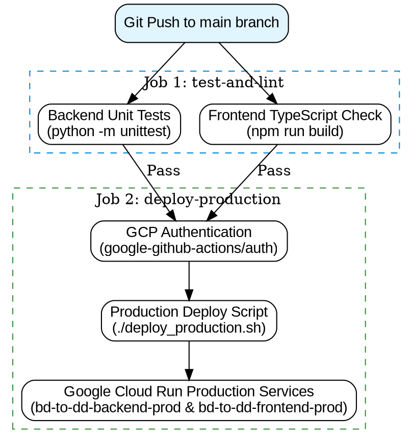

# Design Spec: GitHub Actions CI/CD Pipeline for Cloud Run

## Overview
Automate the test, build, and deployment pipeline for **BD-to-DD Toolkit** on Google Cloud Run via GitHub Actions. Every `push` to the `main` branch automatically runs automated backend and frontend tests, builds production container images, and deploys to Google Cloud Run with zero downtime.

---

## 1. System Architecture & Workflow



---

## 2. Pipeline Trigger & Jobs Specification

### Trigger Events
- `push` to `main` branch.
- `workflow_dispatch` (Manual trigger in GitHub Actions UI).

### Job 1: `test-and-lint`
- **Runner**: `ubuntu-latest`
- **Steps**:
  1. Checkout repository code.
  2. Setup Python 3.11 with caching.
  3. Install backend dependencies from `backend/requirements.txt`.
  4. Execute Python backend unit tests:
     ```bash
     python3 -m unittest discover -s backend/tests
     ```
  5. Setup Node.js 22 with npm cache.
  6. Install frontend dependencies (`npm ci` in `./frontend`).
  7. Verify Next.js build compilation (`npm run build` in `./frontend`).

### Job 2: `deploy-production`
- **Runner**: `ubuntu-latest`
- **Needs**: `test-and-lint` (must pass 100%)
- **Permissions**: `contents: read`, `id-token: write` (for OIDC authentication)
- **Steps**:
  1. Checkout repository code.
  2. Authenticate to Google Cloud using `google-github-actions/auth@v2` via **Workload Identity Federation**:
     - `workload_identity_provider`: `projects/686815886180/locations/global/workloadIdentityPools/github-pool/providers/github-provider`
     - `service_account`: `github-actions-deployer@bd-to-dd.iam.gserviceaccount.com`
  3. Setup Google Cloud SDK using `google-github-actions/setup-gcloud@v2`.
  4. Make `./deploy_production.sh` executable and execute:
     ```bash
     ./deploy_production.sh
     ```

---

## 3. Required GitHub Repository Secrets

The pipeline injects the following secrets into environment variables during execution:

| Secret Name | Description | Source |
| :--- | :--- | :--- |
| `WORKLOAD_IDENTITY_PROVIDER` | Full resource path of the GCP Workload Identity Provider | GCP WIF Setup |
| `GCP_SERVICE_ACCOUNT` | Email of the Service Account (`github-actions-deployer@bd-to-dd.iam.gserviceaccount.com`) | GCP IAM |
| `GEMINI_API_KEY` | Google Gemini AI API key | Google AI Studio |
| `QDRANT_URL` | Dedicated Qdrant Cloud cluster endpoint | Qdrant Cloud Console |
| `QDRANT_API_KEY` | Qdrant Cloud API key | Qdrant Cloud Console |
| `DATABASE_URL` | PostgreSQL / Cloud SQL connection string | Cloud SQL / Neon / Supabase |

---

## 4. Workload Identity Federation Setup (Keyless GCP Auth)

By using Workload Identity Federation (WIF), no long-lived JSON service account keys are created, bypassing GCP's `constraints/iam.disableServiceAccountKeyCreation` organization policy.


The dedicated Service Account `github-actions-deployer@bd-to-dd.iam.gserviceaccount.com` requires:
- `roles/run.admin` (Cloud Run Admin)
- `roles/storage.admin` (Storage Admin for Cloud Build sources & GCS bucket)
- `roles/artifactregistry.writer` (Artifact Registry Writer for container images)
- `roles/iam.serviceAccountUser` (Service Account User for Cloud Run deployment)
- `roles/cloudbuild.builds.editor` (Cloud Build Editor)

---

## 5. Self-Review Check
- [x] **Placeholder scan**: No TBD or vague placeholders.
- [x] **Consistency**: Matches existing `deploy_production.sh` script and Cloud Run setup.
- [x] **Scope**: Scoped precisely to GitHub Actions CI/CD for Production deployment.
